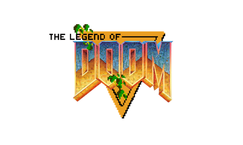

# Legend of Doom 3DS



[](https://github.com/EstebanPdN/legend-of-doom-3ds/actions/workflows/build-3ds.yml)

Nintendo 3DS port of [Legend of Doom](https://github.com/emawind84/legend-of-doom), the first-person GZDoom conversion of the original *The Legend of Zelda* created by DeTwelve Games.

The port is based on GZDoom 4.7.1 and uses the freely redistributable Freedoom: Phase 2 IWAD. No NES ROM or commercial Doom IWAD is required or included in this repository.

## Project status

> [!WARNING]
> This port is experimental. v0.31 is a cleanup candidate; performance and gameplay validation on physical New 3DS remain required.

The supported target is the New Nintendo 3DS family: New Nintendo 3DS, New Nintendo 3DS XL and New Nintendo 2DS XL. The recovery profile renders at 320×200 on the CPU and presents it to the 400×240 top screen without using PICA200 command lists. The accelerated NovaGL path remains experimental.

## Features

* New 3DS support
* Dual-screen support
* CIA and 3DSX packages
* Circle Pad, C-Stick and touch controls
* Full-width 400×240 presentation from a 320×200 game canvas

## Community

Join the Discord for project updates, testing, support and other Nintendo 3DS homebrew projects:

https://discord.gg/SMW49UMkw

## Installation

Candidate downloads are published under [GitHub Releases](https://github.com/EstebanPdN/legend-of-doom-3ds/releases). See the [v0.31 review](platform/3ds/CODE-REVIEW-v031.es.md) for changes and known limits.

The CIA is installable through FBI and embeds its matching game data. 
The 3DSX package includes a matching SD ZIP that expands to:

```text
sdmc:/3ds/legend-of-doom/
├── legend-of-doom-3ds.3dsx
├── README.txt
├── CREDITS.md
├── THIRD-PARTY-LICENSES.md
├── licenses/
└── data/
    ├── LegendOfDoom.pk3
    ├── freedoom2.wad
    ├── game_support.pk3
    └── gzdoom.pk3
```

Audio on real hardware requires the console's own DSP firmware at `sdmc:/3ds/dspfirm.cdc`. With Luma3DS, open the Rosalina menu, choose **Miscellaneous options...**, then **Dump DSP firmware**. This system file is never distributed with the port.

## Controls

| Nintendo 3DS input | Action |
|---|---|
| Circle Pad | Move / strafe |
| C-Stick | Look |
| Touch screen | Look (when camera input is Touch or Both) |
| A | Use / interact |
| B | Unassigned |
| X | Sprint at full health (optional) |
| Y | Jump |
| L / R | Alternate attack / attack |
| ZL / ZR | Previous / next inventory item |
| D-Pad left / right | Previous / next weapon |
| D-Pad down | Use inventory item |
| D-Pad up | Automap |
| START | Pause |
| SELECT | Main menu |

Controller options expose C-Stick sensitivity, C-Stick/Touch/Both camera input,
the full-health X sprint toggle and a read-only control reference.

## Building

Requirements:

- devkitPro, devkitARM, libctru and 3ds-cmake
- CMake, Git, cURL and UnZip
- SDL2 development files for native host tools on Linux
- `makerom` and `bannertool` for CIA packaging; pinned Linux x86_64 binaries are downloaded automatically, while native `makerom-macos` and `bannertool-macos` are detected on macOS

Build all packages with the physical-console-safe profile (the default):

```sh
./platform/3ds/build.sh
```

The equivalent explicit command is shown below. This version starts at the
normal title/menu, uses the CPU renderer and the pinned OpenAL/NDSP audio path:

```sh
LOD3DS_BUILD_PROFILE=hardware-safe ./platform/3ds/build.sh
```

The legacy NovaGL/PICA path is retained only for explicit GPU investigation:

```sh
LOD3DS_BUILD_PROFILE=release ./platform/3ds/build.sh
```

Build the silent first-frame hardware diagnostic with:

```sh
LOD3DS_BUILD_PROFILE=hardware-diagnostic ./platform/3ds/build.sh
```

Build the physical-console candidate with audio and the same watchdog with:

```sh
LOD3DS_BUILD_PROFILE=hardware-candidate ./platform/3ds/build.sh
```

Version 0.19 keeps the physically proven SoftPoly world renderer with the
hybrid PICA200 presentation layer. MAP01 distance fog now excludes intentional
BLACK cave interiors, and OpenAL uses a deeper NDSP queue plus a low-jitter
CPU-to-DSP cache clean with a compatibility fallback. NovaGL world rendering
remains an explicit developer experiment. A physical New 3DS remains the final
validation target; no Azahar result is used as proof of performance or timing.

The scripts download pinned SDL2, ZMusic, minimp3, OpenAL Soft/NDSP, Legend of Doom and Freedoom inputs; apply the documented 3DS patches; build the executable; and write packages below `build-3ds/dist/`.

No ROM, commercial IWAD, save or crash dump is read during the build. See [platform/3ds/README.md](platform/3ds/README.md) for the renderer contract, diagnostic format and complete build options.

## Credits

- [DeTwelve Games](https://youtube.com/DeTwelveGames) — creator of Legend of Doom
- [GZDoom contributors](https://github.com/ZDoom/gzdoom) — engine
- [Freedoom contributors](https://github.com/freedoom/freedoom) — free Phase 2 IWAD
- [NovaGL contributors](https://github.com/efimandreev0/NovaGL) — OpenGL-to-Citro3D bridge
- SDL, ZMusic, OpenAL Soft/NDSP, devkitPro and libctru contributors — platform stack
- Esteban PDN — Nintendo 3DS port and project maintenance

See [CREDITS.md](CREDITS.md) and [THIRD-PARTY-LICENSES.md](THIRD-PARTY-LICENSES.md) for additional notices.

## License and legal notice

The GZDoom-derived source is distributed under GPL-3.0. See [LICENSE](LICENSE).

Third-party code and data retain their respective terms. Legend of Doom's upstream repository does not declare a general license; its data is downloaded only while building and is not committed here. Redistribution must be reviewed separately before any release is published.

*The Legend of Zelda* and related names and content are owned by Nintendo. *Doom* and related names are owned by id Software and their respective rights holders. This is an unofficial fan-made project and is not affiliated with or endorsed by Nintendo, id Software or Bethesda.
